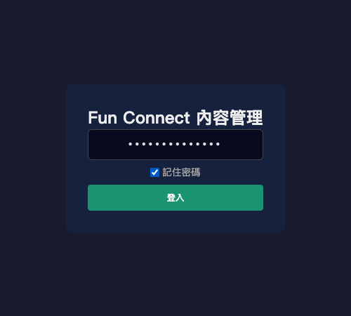
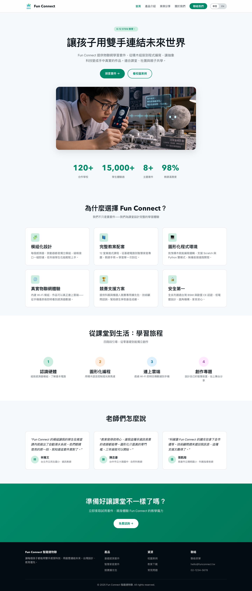

# Fun Connect CMS 使用手冊

## 登入

1. 打開 `https://funconnect.techforliving.net/admin/`
2. 輸入密碼：`funconnect2024`
3. 勾選「記住密碼」可跳過每次輸入

## 編輯內容

### 介面

- **左側**：編輯器（分頁表單，中英雙語對照）
- **右側**：即時預覽（與網站樣式一致）

### 編輯分頁

| 分頁 | 對應網站區塊 |
|------|------------|
| 導航 | 導航列文字 |
| Hero | 主視覺標語 |
| 統計 | 數字展示 |
| 特色 | 六個特色卡片 |
| 評價 | 老師推薦 |
| 旅程 | 學習四步驟 |
| CTA | 行動呼籲橫幅 |
| 圖片 | Logo、主圖、產品圖 URL |
| 產品標題 | 產品頁大標 |
| 基礎/智慧/競賽套件 | 產品資訊（名稱、描述、價格、圖片） |
| FAQ | 常見問題 |
| 案例 | 校園案例故事 |
| 關於 | 關於我們 |
| 聯絡 | 聯絡表單資訊 |
| 頁尾 | 頁尾連結 |

### 操作技巧

- **點擊預覽區塊** → 自動跳到對應編輯分頁
- **即時編輯** → 修改文字立即顯示在右側預覽
- **中英切換** → 導航列右側 中文/EN 按鈕
- **圖片更換** → 在「圖片」分頁填入圖片 URL

## 儲存與更新

1. 按「儲存」按鈕
2. 內容寫入 Cloudflare KV
3. **網站立即更新，無需等待部署！**

## 技術說明

- 內容儲存在 Cloudflare KV（key-value 儲存）
- 儲存後即時生效，訪客重新整理即可看到最新內容
- 不需要 GitHub、不需要重新部署
