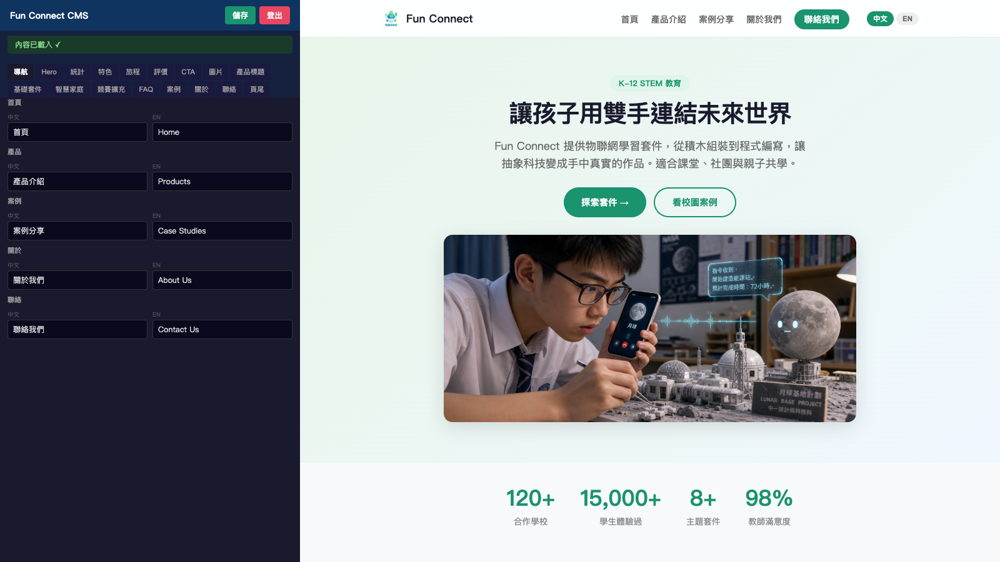

# Fun Connect CMS 使用手冊

## 登入

1. 打開 `https://funconnect.techforliving.net/admin/`
2. 輸入密碼：`funconnect2024`
3. 勾選「記住密碼」可跳過下次輸入

## 編輯內容

### 介面說明

- **左側**：編輯器面板（分頁表單）
- **右側**：即時預覽（與網站樣式一致）

### 編輯方式

每個分頁對應網站的一個區塊：

| 分頁 | 對應網站區塊 |
|------|------------|
| 導航 | 導航列文字 |
| Hero | 主視覺標語 |
| 統計 | 數字展示（合作學校、學生數等） |
| 特色 | 六個特色卡片 |
| 評價 | 老師推薦 |
| 旅程 | 學習四步驟 |
| CTA | 行動呼籲橫幅 |
| 圖片 | Logo、主圖、產品圖 URL |
| 產品標題 | 產品頁大標 |
| 基礎套件 | 基礎感測套件資訊 |
| 智慧家庭 | 智慧家庭套件資訊 |
| 競賽擴充 | 競賽擴充包資訊 |
| FAQ | 常見問題 |
| 案例 | 校園案例故事 |
| 關於 | 關於我們 |
| 聯絡 | 聯絡表單資訊 |
| 頁尾 | 頁尾連結 |

### 即時預覽

- 點擊預覽區塊 → 自動跳到對應編輯分頁
- 導航列可點擊 → 平滑捲動到各區塊
- 產品頁籤可切換 → 預覽不同套件
- 中英文切換按鈕 → 切換預覽語言
- **修改文字即時顯示在右側預覽**

### 圖片更換

在「圖片」分頁填入圖片 URL：
- `hero_img`：首頁主圖
- `logo_img`：導航列 Logo
- 產品分頁中的 `img`：各產品圖片

### 儲存

1. 修改完畢後按「儲存」按鈕
2. 內容寫入 GitHub
3. 需手動部署網站才能看到更新

## 注意事項

- 修改後**不會自動**更新網站，需執行部署
- 支援中英雙語，每個欄位都有中文和英文兩個輸入框
- 長文字（描述、內文）使用多行輸入框，短文字（標題、按鈕）使用單行
